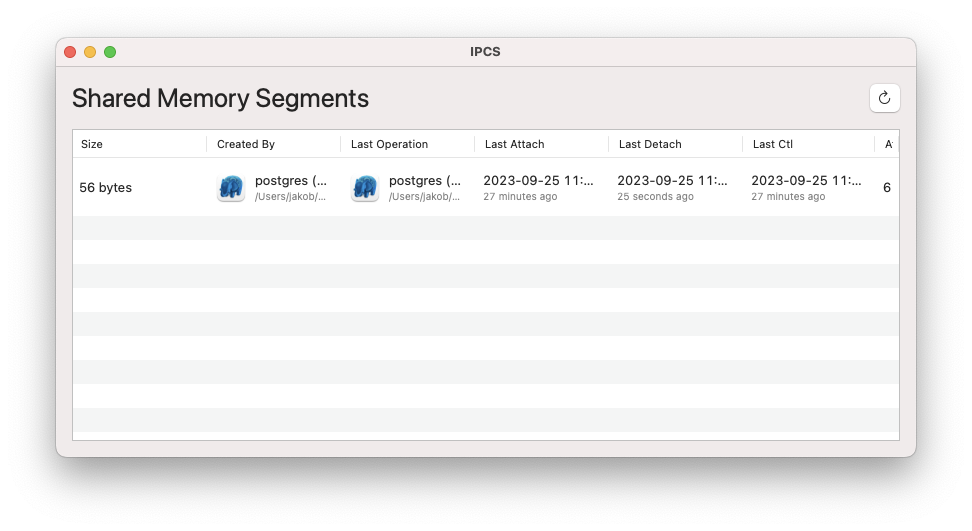

# IPCS GUI

PostgreSQL not starting because it can't create a shared memory segment? What app is using all my shared memory?

This app shows a list of shared memory segments currently in use on your Mac. That's all.

You could also use the command line tool ipcs to answer that question, but IPCS.app looks prettier.
